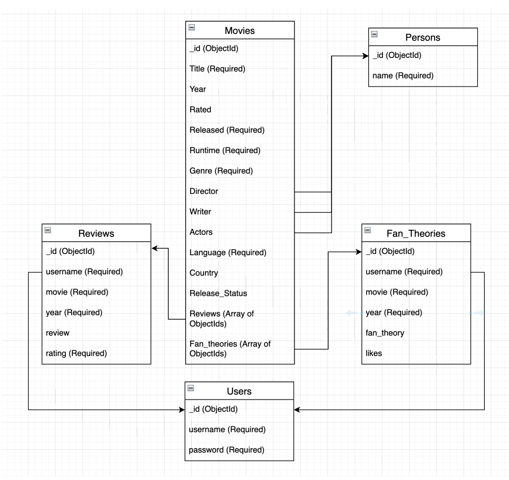

# Movie Review Portal
### Project Timeline Note: 
This project was originally developed between August 2023 and December 2023. However, it has been recently uploaded to GitHub for sharing and documentation purposes. While the commit history may not reflect the original development timeline, feel free to explore the project and reach out with any questions or feedback.
## Project Description
This is an application used to display movie ratings and reviews for movies listed. Admin can add movies to the portal. The movies can have ratings already and for a few movies, there won’t be any reviews and the users can start adding reviews and ratings. Average ratings and top reviews are displayed for movies. A movie present in the database can be searched and the subsequent ratings and reviews are displayed. This application is helpful for movie buffs to understand the ratings and give reviews of the movies. Having such a kind of portal which is driven by ratings and reviews given by users rather than only a few selected critics would make the reviews and ratings transparent and not influenced by anyone.
## Dataset Description
### Source
https://www.kaggle.com/datasets/jillanisofttech/imdb-top-250-eng-movies-dataset
### Description
The IMDB Top 250 English Movies dataset, available on Kaggle, provides comprehensive information about the top-rated English-language movies as listed on the Internet Movie Database (IMDB). This dataset is a valuable resource for the Movie Review Portal project, offering rich data about some of the most acclaimed films.
### Use case
The dataset is an invaluable resource for the Movie Review Portal project, as it provides a diverse collection of critically acclaimed movies. The data can be used to populate the portal's movie database, allowing users to search, rate, and review these top-rated English-language films. It enhances the portal's content and provides users with a curated selection of movies to engage with and review.
## Database
We have chosen MongoDB as our database as its flexible, schema-less document model allows for easy adaptation to changing data requirements. Below are the reasons for choosing:
* This flexibility is beneficial when dealing with diverse entities like movies, reviews, and fan theories, where attributes may vary.
* The ability to store nested documents within a document (subdocuments) makes it convenient to represent complex relationships, such as associating reviews or fan theories with movies, without the need for complex JOIN operations.
* Its horizontal scalability makes it well-suited for handling large amounts of data. As the project grows, It can handle increased data volumes by distributing data across multiple servers.
* The use of JSON-like BSON documents simplifies integration with JavaScript-based technologies, like Node JS and React JS.
* For activities like fetching reviews for a specific movie, It provides indexing support, enhancing query performance.
* Storing data as documents aligns well with the natural structure of the project's entities. Each movie, review, person, or fan theory can be represented as a document, making it intuitive to work with.
Overall, Since our project needs to handle dynamic changes in the data like adding new movies, MongoDB's flexibility is advantageous to us.
## Schema
The schema for the database outlines the structure and organization of data, defining the entities, their attributes, and the relationships between them. In our schema, entities such as Movie, Person, User, Review, and Fan Theory are identified, each with specific attributes detailing their properties. Relationships, including one-to-many and many-to-many connections, illustrate how these entities interact. The schema serves as a blueprint for organizing information and facilitating efficient data storage and retrieval. It plays a crucial role in maintaining data integrity, ensuring consistency across the database, and providing a foundation for effective query operations. The schema design reflects a thoughtful approach to representing diverse data types and their associations within the context of the application or project.

